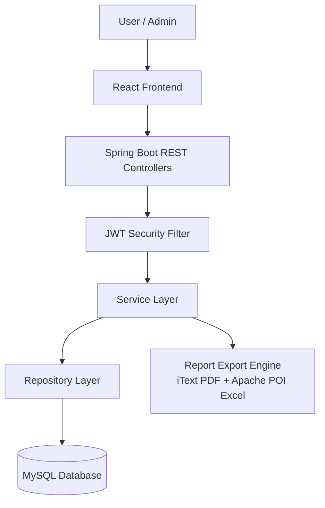
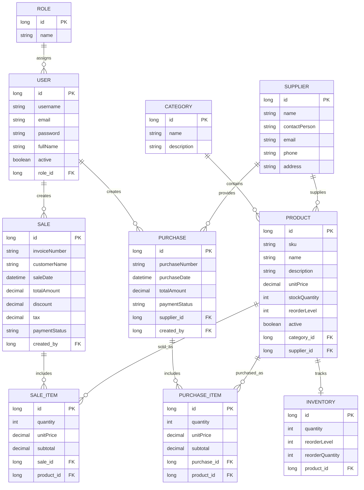
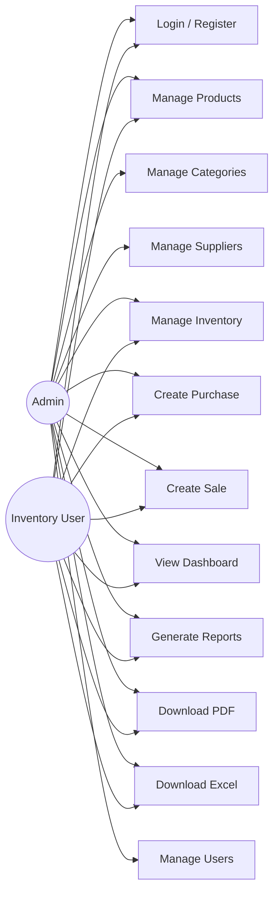
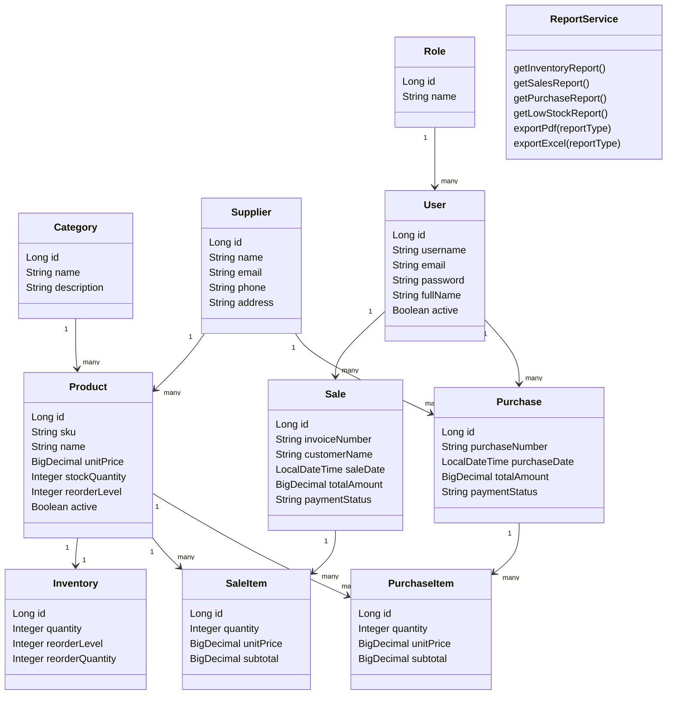
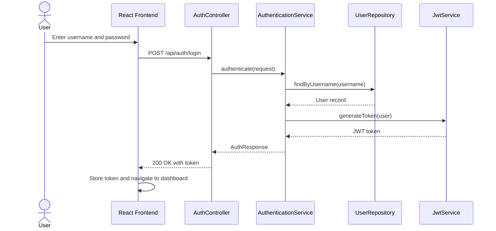
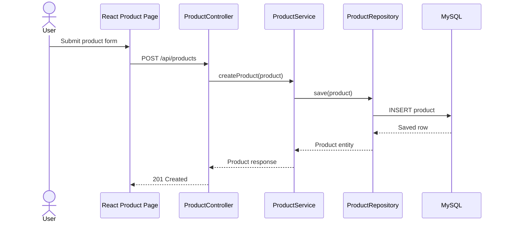
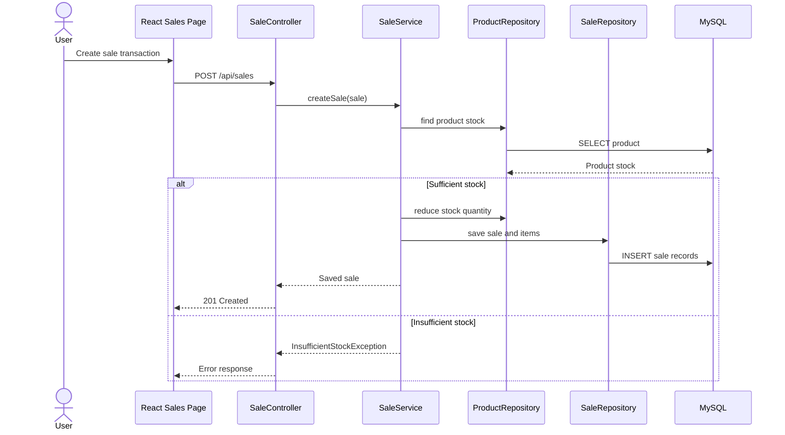
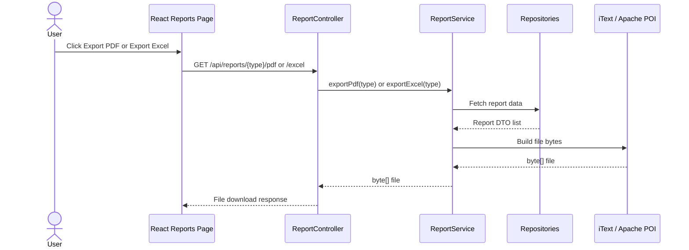

# Smart Inventory Management System

## Complete University Final Year Project Report

**Project Type:** Web-based Inventory Management Application  
**Backend:** Java 17, Spring Boot 3.3.1, Spring Security, Spring Data JPA  
**Frontend:** React 18, Vite, Axios, Chart.js  
**Database:** MySQL 8.4  
**Exports:** PDF using iText, Excel using Apache POI  
**Academic Year:** 2025-2026

---

## Table of Contents

1. Introduction
2. Objectives
3. Problem Statement
4. Scope
5. OOP Concepts
6. System Architecture
7. ER Diagram
8. Use Case Diagram
9. Class Diagram
10. Sequence Diagrams
11. API Documentation
12. Screenshots
13. Conclusion
14. Future Improvements

---

# 1. Introduction

The Smart Inventory Management System is a full-stack web application designed to help an organization manage products, suppliers, stock levels, purchases, sales, users, dashboards, and business reports from a centralized system. The project replaces manual record keeping with a structured digital platform where users can track available stock, process stock-increasing purchase transactions, process stock-reducing sales transactions, monitor low-stock products, and generate exportable reports.

The application follows a modern client-server architecture. The frontend is built with React and communicates with the backend through REST APIs. The backend is developed using Spring Boot and provides business logic, authentication, validation, persistence, reporting, and file export functionality. MySQL is used as the relational database for storing master data and transaction records.

A major feature of the system is its reporting module. The system supports four business reports: Inventory Report, Sales Report, Purchase Report, and Low Stock Report. Each report can be previewed through REST APIs and downloaded as PDF or Excel files. PDF export is implemented using iText, while Excel export is implemented using Apache POI.

## 1.1 Technology Stack

| Layer | Technology |
| --- | --- |
| Frontend | React 18, Vite, React Router, Axios, Chart.js, CSS |
| Backend | Java 17, Spring Boot 3.3.1, Spring Web, Spring Security, Spring Data JPA |
| Database | MySQL 8.4 |
| Authentication | JWT token-based authentication |
| Reporting | iText PDF, Apache POI Excel |
| Documentation/API | Springdoc OpenAPI annotations |
| Testing | JUnit 5, Mockito, Spring Test, H2 test database |
| Build Tools | Maven for backend, npm/Vite for frontend |

---

# 2. Objectives

The main objective of the Smart Inventory Management System is to provide a reliable, secure, and easy-to-use platform for managing inventory and related business transactions.

## 2.1 Primary Objectives

- To maintain product, category, supplier, inventory, sales, purchase, and user records in a centralized database.
- To automate stock updates during sales and purchase operations.
- To prevent invalid stock reduction when available quantity is insufficient.
- To identify low-stock products based on reorder levels.
- To provide dashboard summaries for better decision-making.
- To generate Inventory, Sales, Purchase, and Low Stock reports.
- To allow users to export reports in PDF and Excel formats.
- To secure the application using JWT authentication.

## 2.2 Secondary Objectives

- To demonstrate object-oriented programming principles in a real Java project.
- To design a layered backend architecture that separates controller, service, repository, entity, DTO, and security responsibilities.
- To provide a responsive frontend interface for day-to-day operations.
- To expose RESTful APIs that can be reused by web, mobile, or third-party clients.
- To create documentation suitable for academic evaluation and future maintenance.

---

# 3. Problem Statement

Many small and medium businesses still manage inventory manually using paper records or spreadsheet files. This approach creates several problems:

- Stock information may not be updated in real time.
- Manual calculations increase the chance of human error.
- Low-stock products may be noticed too late.
- Sales and purchase records may become inconsistent.
- Report generation is time-consuming.
- Historical transaction data is difficult to analyze.
- Access control is limited or missing.

The Smart Inventory Management System solves these problems by providing a computerized platform where stock quantities are updated automatically, transaction records are stored in a database, reports can be generated instantly, and authenticated users can manage system data securely.

---

# 4. Scope

## 4.1 Included Scope

The system includes the following functional modules:

| Module | Description |
| --- | --- |
| Authentication | Login and registration with JWT authentication. |
| User Management | Manage user records and assign roles. |
| Product Management | Create, update, search, view, and delete product records. |
| Category Management | Manage product categories. |
| Supplier Management | Manage supplier information. |
| Inventory Management | Track stock quantity, reorder level, and product stock records. |
| Purchase Management | Record purchases and increase stock quantity. |
| Sales Management | Record sales and reduce stock quantity with validation. |
| Dashboard | Show total products, low-stock products, monthly sales, and monthly purchases. |
| Reports | Generate inventory, sales, purchase, and low-stock reports. |
| Export | Download reports as PDF and Excel files. |

## 4.2 Excluded Scope

The following features are outside the current project scope:

- Barcode scanning hardware integration.
- Online payment gateway integration.
- Multi-warehouse stock transfer.
- Mobile application.
- AI-based demand forecasting.
- Real-time push notifications.
- Cloud deployment automation.

## 4.3 Project Boundaries

The project is designed as a university final year project and demonstrates complete CRUD operations, transaction handling, stock business rules, authentication, reporting, and documentation. It is suitable for local or internal organizational deployment after environment configuration.

---

# 5. OOP Concepts

The backend is implemented in Java and demonstrates object-oriented programming principles.

## 5.1 Encapsulation

Encapsulation is achieved by defining entity and DTO classes with private fields and public accessor methods. Examples include Product, Category, Supplier, Inventory, Sale, Purchase, User, and report DTO classes. Entity classes hide internal data and expose controlled access through methods.

Example application areas:

- Product stores SKU, name, price, stock quantity, category, and supplier.
- Sale stores invoice data, customer details, totals, and sale items.
- Purchase stores purchase number, supplier, payment status, and purchase items.

## 5.2 Inheritance

The project contains an OOP demonstration package with a base product abstraction and specialized product classes such as ElectronicProduct, FoodProduct, and FurnitureProduct. These classes show how common product behavior can be inherited and specialized.

## 5.3 Polymorphism

Polymorphism is demonstrated when different product types implement or override behavior such as discount calculation or tax calculation. Interfaces such as Discountable and Taxable support polymorphic behavior by allowing different classes to provide their own implementations.

## 5.4 Abstraction

Abstraction is used throughout the application:

- Repository interfaces hide database query implementation details.
- Service classes expose business operations without exposing persistence logic to controllers.
- DTO classes abstract API response shapes from database entities.
- Interfaces in the OOP demo package define behavior contracts.

## 5.5 Association and Relationships

The system uses object associations to model business relationships:

- A Category has many Products.
- A Supplier supplies many Products and Purchases.
- A Sale has many SaleItems.
- A Purchase has many PurchaseItems.
- A User creates Sales and Purchases.
- A Role can be assigned to many Users.

---

# 6. System Architecture

The Smart Inventory Management System follows a layered architecture.



## 6.1 Frontend Layer

The frontend provides pages for login, dashboard, products, categories, suppliers, inventory, sales, purchases, and reports. It uses Axios to call backend APIs and stores JWT tokens in browser local storage for authenticated requests.

## 6.2 Controller Layer

Spring REST controllers receive HTTP requests, validate request paths and parameters, call service methods, and return HTTP responses. Controllers include AuthController, ProductController, CategoryController, SupplierController, InventoryController, SaleController, PurchaseController, DashboardController, ReportController, and UserController.

## 6.3 Service Layer

The service layer contains business logic. Examples include stock reduction during sales, stock increase during purchases, report data preparation, PDF export, Excel export, and user authentication workflow.

## 6.4 Repository Layer

Repository interfaces extend Spring Data JPA repositories and provide database access. Custom queries are used for reports and dashboard summaries.

## 6.5 Database Layer

The database stores relational data for users, roles, products, categories, suppliers, inventory records, sales, sale items, purchases, and purchase items.

---

# 7. ER Diagram



---

# 8. Use Case Diagram



## 8.1 Use Case Descriptions

| Use Case | Actor | Description |
| --- | --- | --- |
| Login / Register | Admin, User | Authenticates users and issues JWT tokens. |
| Manage Products | Admin, User | Creates, updates, searches, views, and deletes products. |
| Manage Categories | Admin | Maintains product grouping data. |
| Manage Suppliers | Admin | Maintains supplier records. |
| Manage Inventory | Admin, User | Tracks and updates inventory records. |
| Create Purchase | Admin, User | Records stock purchase and increases product quantity. |
| Create Sale | Admin, User | Records product sale and reduces product quantity. |
| View Dashboard | Admin, User | Shows business summary and charts. |
| Generate Reports | Admin, User | Displays inventory, sales, purchase, and low-stock report data. |
| Download PDF | Admin, User | Exports selected report as a PDF file. |
| Download Excel | Admin, User | Exports selected report as an XLSX file. |
| Manage Users | Admin | Maintains user accounts. |

---

# 9. Class Diagram



---

# 10. Sequence Diagrams

## 10.1 Login Sequence



## 10.2 Product Management Sequence



## 10.3 Sales Stock Reduction Sequence



## 10.4 Report Export Sequence



---

# 11. API Documentation

## 11.1 Base URL

```text
http://localhost:8080/api
```

## 11.2 Authentication

All protected APIs require the following header:

```text
Authorization: Bearer <JWT_TOKEN>
```

## 11.3 Authentication APIs

| Method | Endpoint | Description |
| --- | --- | --- |
| POST | /auth/register | Register a new user. |
| POST | /auth/login | Authenticate user and return JWT token. |

## 11.4 Product APIs

| Method | Endpoint | Description |
| --- | --- | --- |
| GET | /products | Get all products. |
| GET | /products/{id} | Get product by ID. |
| GET | /products/search | Search products by name. |
| POST | /products | Create product. |
| PUT | /products/{id} | Update product. |
| DELETE | /products/{id} | Delete product. |

## 11.5 Category APIs

| Method | Endpoint | Description |
| --- | --- | --- |
| GET | /categories | Get all categories. |
| GET | /categories/{id} | Get category by ID. |
| POST | /categories | Create category. |
| PUT | /categories/{id} | Update category. |
| DELETE | /categories/{id} | Delete category. |

## 11.6 Supplier APIs

| Method | Endpoint | Description |
| --- | --- | --- |
| GET | /suppliers | Get all suppliers. |
| GET | /suppliers/{id} | Get supplier by ID. |
| GET | /suppliers/search | Search suppliers by name. |
| POST | /suppliers | Create supplier. |
| PUT | /suppliers/{id} | Update supplier. |
| DELETE | /suppliers/{id} | Delete supplier. |

## 11.7 Inventory APIs

| Method | Endpoint | Description |
| --- | --- | --- |
| GET | /inventory | Get all inventory records. |
| GET | /inventory/{id} | Get inventory record by ID. |
| GET | /inventory/product/{productId} | Get inventory by product ID. |
| POST | /inventory | Create inventory record. |
| PUT | /inventory/{id} | Update inventory record. |
| POST | /inventory/stock/add | Add stock to a product. |
| POST | /inventory/stock/reduce | Reduce stock from a product. |

## 11.8 Sales APIs

| Method | Endpoint | Description |
| --- | --- | --- |
| GET | /sales | Get all sales. |
| GET | /sales/{id} | Get sale by ID. |
| POST | /sales | Create sale and reduce stock. |
| PUT | /sales/{id} | Update sale. |
| DELETE | /sales/{id} | Delete sale. |
| POST | /sales/reduce-stock | Business rule endpoint for reducing stock. |

## 11.9 Purchase APIs

| Method | Endpoint | Description |
| --- | --- | --- |
| GET | /purchases | Get all purchases. |
| GET | /purchases/{id} | Get purchase by ID. |
| POST | /purchases | Create purchase and add stock. |
| PUT | /purchases/{id} | Update purchase. |
| DELETE | /purchases/{id} | Delete purchase. |
| POST | /purchases/add-stock | Business rule endpoint for adding stock. |

## 11.10 Dashboard APIs

| Method | Endpoint | Description |
| --- | --- | --- |
| GET | /dashboard | Get dashboard summary. |
| GET | /dashboard/low-stock-products | Get low-stock product list. |
| GET | /dashboard/monthly-sales | Get monthly sales totals. |
| GET | /dashboard/monthly-purchases | Get monthly purchase totals. |

## 11.11 Report APIs

| Method | Endpoint | Description | Output |
| --- | --- | --- | --- |
| GET | /reports/inventory | Get inventory report preview data. | JSON |
| GET | /reports/sales | Get sales report preview data. | JSON |
| GET | /reports/purchases | Get purchase report preview data. | JSON |
| GET | /reports/low-stock | Get low-stock report preview data. | JSON |
| GET | /reports/{reportType}/pdf | Download report as PDF. | application/pdf |
| GET | /reports/{reportType}/excel | Download report as Excel. | application/vnd.openxmlformats-officedocument.spreadsheetml.sheet |

Supported reportType values:

- inventory
- sales
- purchases
- low-stock

## 11.12 User APIs

| Method | Endpoint | Description |
| --- | --- | --- |
| GET | /users | Get all users. |
| GET | /users/{id} | Get user by ID. |
| POST | /users | Create user. |
| PUT | /users/{id} | Update user. |
| DELETE | /users/{id} | Delete user. |

## 11.13 Common HTTP Status Codes

| Status | Meaning |
| --- | --- |
| 200 OK | Request completed successfully. |
| 201 Created | New record created successfully. |
| 400 Bad Request | Invalid request data or unsupported report type. |
| 401 Unauthorized | Missing or invalid JWT token. |
| 403 Forbidden | User does not have permission. |
| 404 Not Found | Requested record does not exist. |
| 500 Internal Server Error | Server-side error. |

---

# 12. Screenshots

The following screenshots should be included in the submitted printed or PDF report. The application currently contains frontend pages for these screens; actual screenshots can be captured after running the backend and frontend locally.

| Figure | Screen | Description |
| --- | --- | --- |
| Figure 12.1 | Login Page | User authentication screen where users enter credentials. |
| Figure 12.2 | Dashboard Page | Summary cards, charts, low-stock indicators, monthly sales, and monthly purchases. |
| Figure 12.3 | Product Management Page | Product list with create, edit, delete, and search operations. |
| Figure 12.4 | Category Management Page | Category records used to classify products. |
| Figure 12.5 | Supplier Management Page | Supplier list and supplier form. |
| Figure 12.6 | Inventory Page | Stock quantity, reorder level, and inventory tracking records. |
| Figure 12.7 | Sales Page | Sales transaction entry and stock reduction workflow. |
| Figure 12.8 | Purchase Page | Purchase transaction entry and stock addition workflow. |
| Figure 12.9 | Reports Page | Inventory, Sales, Purchase, and Low Stock report tabs. |
| Figure 12.10 | PDF Export | Downloaded PDF report generated by iText. |
| Figure 12.11 | Excel Export | Downloaded Excel report generated by Apache POI. |

Suggested screenshot placement in the final document:

```text
[Insert Screenshot: Login Page]
[Insert Screenshot: Dashboard Page]
[Insert Screenshot: Products Page]
[Insert Screenshot: Inventory Page]
[Insert Screenshot: Reports Page]
[Insert Screenshot: PDF Export Output]
[Insert Screenshot: Excel Export Output]
```

---

# 13. Conclusion

The Smart Inventory Management System successfully provides a complete digital solution for inventory management. It includes product, category, supplier, inventory, sales, purchase, dashboard, user, authentication, and reporting modules. The system applies object-oriented programming concepts, uses a layered Spring Boot backend, provides a React-based frontend, and stores data in a MySQL relational database.

The report module strengthens the project by allowing business users to generate Inventory, Sales, Purchase, and Low Stock reports and export them as PDF and Excel files. This makes the system useful not only for daily operations but also for management review and academic demonstration.

Overall, the project meets the requirements of a university final year project because it demonstrates practical software engineering concepts, database design, REST API development, authentication, frontend integration, reporting, and documentation.

---

# 14. Future Improvements

The following improvements can be added in future versions:

## 14.1 Functional Improvements

- Barcode or QR code scanning for product lookup.
- Multi-warehouse stock management.
- Supplier purchase order approval workflow.
- Customer management and invoice printing.
- Email notifications for low-stock products.
- Role-based permission matrix for admin, manager, and staff users.
- Audit logs for sensitive operations.

## 14.2 Reporting Improvements

- Date-range filters for sales and purchase reports.
- Category-wise and supplier-wise report grouping.
- Profit and loss report.
- Top-selling product report.
- Export templates with company logo and report metadata.
- Scheduled email delivery of reports.

## 14.3 Technical Improvements

- Docker-based deployment.
- CI/CD pipeline with automated tests.
- Cloud database and cloud hosting.
- Redis caching for dashboard data.
- WebSocket notifications for live stock updates.
- Enhanced exception handling with standardized response format.
- More frontend automated tests.

## 14.4 Long-Term Enhancements

- AI-based demand forecasting.
- Predictive reorder recommendations.
- Mobile application for warehouse staff.
- Integration with accounting systems.
- Integration with e-commerce platforms.

---

# Final Summary

The Smart Inventory Management System is a complete full-stack application that manages inventory workflows from product creation to sales, purchases, stock monitoring, and report generation. It is suitable for academic submission and demonstrates practical implementation of Java, Spring Boot, React, MySQL, OOP concepts, RESTful APIs, authentication, reporting, and export functionality.
