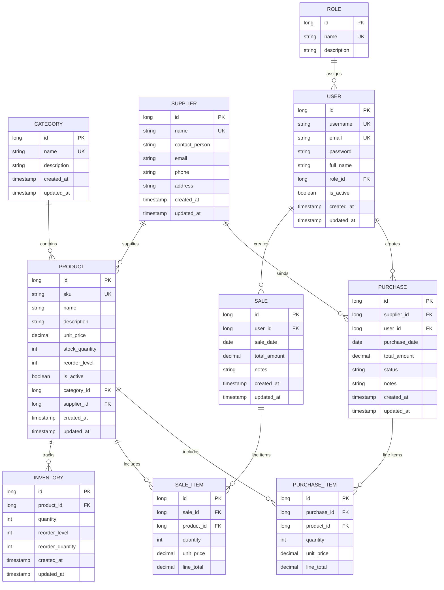
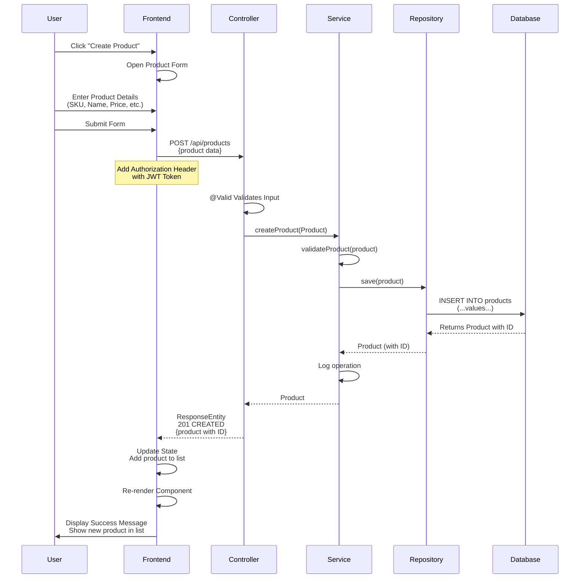
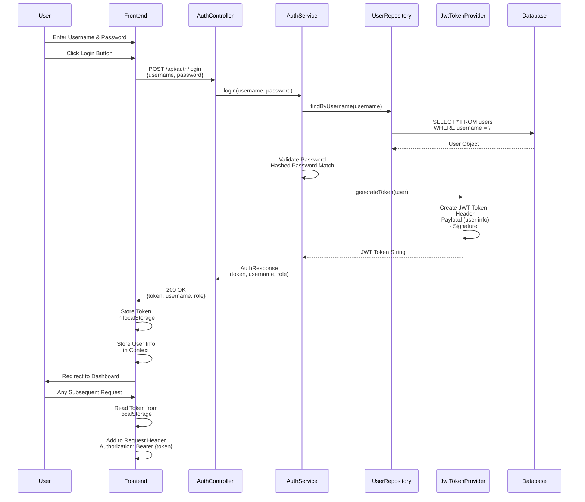
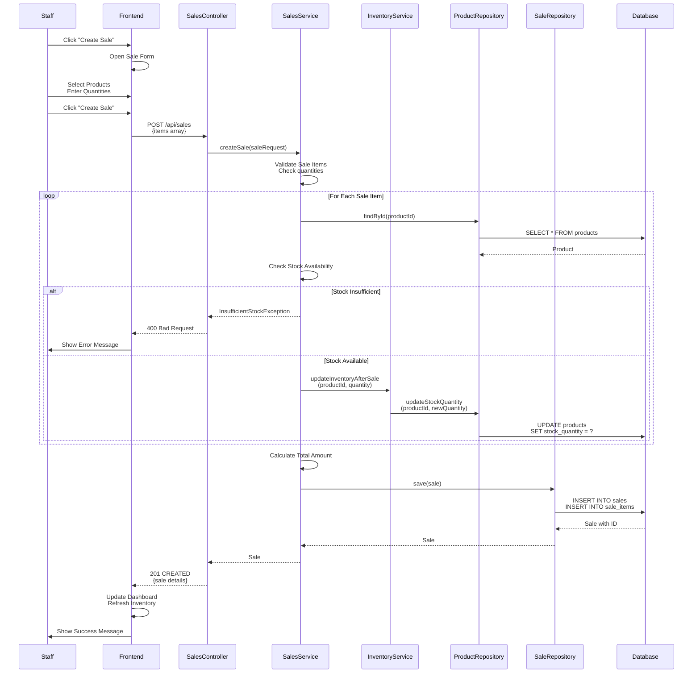
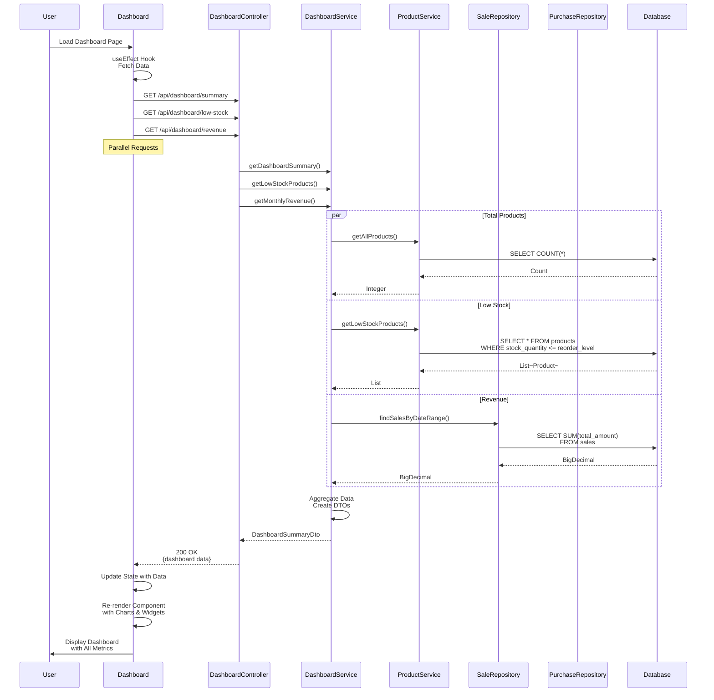

# SMART INVENTORY MANAGEMENT SYSTEM
## Complete Project Documentation - PART 2

# ER DIAGRAM (Entity-Relationship Diagram)

## Logical ER Diagram

## Database Schema Description

### CATEGORY Table
- **Purpose**: Store product categories
- **Primary Key**: id
- **Unique Keys**: name
- **Relationships**: One-to-Many with PRODUCT

| Column | Type | Constraints | Description |
|--------|------|-------------|-------------|
| id | BIGINT | PK, AUTO_INCREMENT | Unique category identifier |
| name | VARCHAR(100) | NOT NULL, UNIQUE | Category name |
| description | VARCHAR(255) | - | Category description |
| created_at | TIMESTAMP | NOT NULL | Record creation time |
| updated_at | TIMESTAMP | NOT NULL | Last update time |

### PRODUCT Table
- **Purpose**: Store product information
- **Primary Key**: id
- **Unique Keys**: sku
- **Foreign Keys**: category_id, supplier_id

| Column | Type | Constraints | Description |
|--------|------|-------------|-------------|
| id | BIGINT | PK, AUTO_INCREMENT | Unique product identifier |
| sku | VARCHAR(50) | NOT NULL, UNIQUE | Stock Keeping Unit |
| name | VARCHAR(150) | NOT NULL | Product name |
| description | TEXT | - | Detailed description |
| unit_price | DECIMAL(10,2) | NOT NULL | Price per unit |
| stock_quantity | INT | NOT NULL, DEFAULT 0 | Current stock |
| reorder_level | INT | NOT NULL | Minimum stock before reorder |
| is_active | BOOLEAN | NOT NULL, DEFAULT true | Active/Inactive status |
| category_id | BIGINT | NOT NULL, FK | Reference to category |
| supplier_id | BIGINT | FK | Reference to supplier |
| created_at | TIMESTAMP | NOT NULL | Record creation time |
| updated_at | TIMESTAMP | NOT NULL | Last update time |

### SUPPLIER Table
- **Purpose**: Store supplier information
- **Primary Key**: id
- **Unique Keys**: name

| Column | Type | Constraints | Description |
|--------|------|-------------|-------------|
| id | BIGINT | PK, AUTO_INCREMENT | Unique supplier identifier |
| name | VARCHAR(150) | NOT NULL, UNIQUE | Supplier company name |
| contact_person | VARCHAR(100) | - | Primary contact name |
| email | VARCHAR(100) | - | Contact email |
| phone | VARCHAR(20) | - | Contact phone number |
| address | VARCHAR(255) | - | Supplier address |
| created_at | TIMESTAMP | NOT NULL | Record creation time |
| updated_at | TIMESTAMP | NOT NULL | Last update time |

### INVENTORY Table
- **Purpose**: Track inventory levels
- **Primary Key**: id
- **Foreign Keys**: product_id

| Column | Type | Constraints | Description |
|--------|------|-------------|-------------|
| id | BIGINT | PK, AUTO_INCREMENT | Unique inventory record |
| product_id | BIGINT | NOT NULL, FK, UNIQUE | Reference to product |
| quantity | INT | NOT NULL, DEFAULT 0 | Current quantity |
| reorder_level | INT | NOT NULL | Minimum stock threshold |
| reorder_quantity | INT | NOT NULL | Quantity to order |
| created_at | TIMESTAMP | NOT NULL | Record creation time |
| updated_at | TIMESTAMP | NOT NULL | Last update time |

### USER Table
- **Purpose**: Store user accounts
- **Primary Key**: id
- **Unique Keys**: username, email
- **Foreign Keys**: role_id

| Column | Type | Constraints | Description |
|--------|------|-------------|-------------|
| id | BIGINT | PK, AUTO_INCREMENT | Unique user identifier |
| username | VARCHAR(50) | NOT NULL, UNIQUE | Login username |
| email | VARCHAR(100) | NOT NULL, UNIQUE | User email |
| password | VARCHAR(255) | NOT NULL | Hashed password |
| full_name | VARCHAR(150) | - | User's full name |
| role_id | BIGINT | NOT NULL, FK | Reference to role |
| is_active | BOOLEAN | NOT NULL, DEFAULT true | Account active status |
| created_at | TIMESTAMP | NOT NULL | Record creation time |
| updated_at | TIMESTAMP | NOT NULL | Last update time |

### ROLE Table
- **Purpose**: Define user roles
- **Primary Key**: id
- **Unique Keys**: name

| Column | Type | Constraints | Description |
|--------|------|-------------|-------------|
| id | BIGINT | PK, AUTO_INCREMENT | Unique role identifier |
| name | VARCHAR(50) | NOT NULL, UNIQUE | Role name |
| description | VARCHAR(255) | - | Role description |

### SALE Table
- **Purpose**: Record sales transactions
- **Primary Key**: id
- **Foreign Keys**: user_id

| Column | Type | Constraints | Description |
|--------|------|-------------|-------------|
| id | BIGINT | PK, AUTO_INCREMENT | Unique sale identifier |
| user_id | BIGINT | NOT NULL, FK | User who recorded sale |
| sale_date | DATE | NOT NULL | Date of sale |
| total_amount | DECIMAL(12,2) | NOT NULL, DEFAULT 0 | Total sale amount |
| notes | TEXT | - | Sale notes |
| created_at | TIMESTAMP | NOT NULL | Record creation time |
| updated_at | TIMESTAMP | NOT NULL | Last update time |

### SALE_ITEM Table
- **Purpose**: Detail line items in sales
- **Primary Key**: id
- **Foreign Keys**: sale_id, product_id

| Column | Type | Constraints | Description |
|--------|------|-------------|-------------|
| id | BIGINT | PK, AUTO_INCREMENT | Unique item identifier |
| sale_id | BIGINT | NOT NULL, FK | Reference to sale |
| product_id | BIGINT | NOT NULL, FK | Reference to product |
| quantity | INT | NOT NULL | Quantity sold |
| unit_price | DECIMAL(10,2) | NOT NULL | Price at time of sale |
| line_total | DECIMAL(12,2) | NOT NULL | Quantity × Unit Price |

### PURCHASE Table
- **Purpose**: Record purchase orders
- **Primary Key**: id
- **Foreign Keys**: supplier_id, user_id

| Column | Type | Constraints | Description |
|--------|------|-------------|-------------|
| id | BIGINT | PK, AUTO_INCREMENT | Unique purchase identifier |
| supplier_id | BIGINT | NOT NULL, FK | Reference to supplier |
| user_id | BIGINT | NOT NULL, FK | User who created purchase |
| purchase_date | DATE | NOT NULL | Date of purchase |
| total_amount | DECIMAL(12,2) | NOT NULL, DEFAULT 0 | Total purchase amount |
| status | VARCHAR(50) | NOT NULL, DEFAULT 'PENDING' | Order status |
| notes | TEXT | - | Purchase notes |
| created_at | TIMESTAMP | NOT NULL | Record creation time |
| updated_at | TIMESTAMP | NOT NULL | Last update time |

### PURCHASE_ITEM Table
- **Purpose**: Detail line items in purchases
- **Primary Key**: id
- **Foreign Keys**: purchase_id, product_id

| Column | Type | Constraints | Description |
|--------|------|-------------|-------------|
| id | BIGINT | PK, AUTO_INCREMENT | Unique item identifier |
| purchase_id | BIGINT | NOT NULL, FK | Reference to purchase |
| product_id | BIGINT | NOT NULL, FK | Reference to product |
| quantity | INT | NOT NULL | Quantity ordered |
| unit_price | DECIMAL(10,2) | NOT NULL | Price at time of order |
| line_total | DECIMAL(12,2) | NOT NULL | Quantity × Unit Price |

---

# USE CASE DIAGRAM

```mermaid
graph TB
    User((User))
    Admin((Admin))
    Manager((Manager))
    Staff((Staff))
    Viewer((Viewer))
    System[("Smart Inventory<br/>Management System")]

    User -->|Login| System
    User -->|Manage Profile| System

    Admin -->|All Viewer Operations| System
    Admin -->|All Manager Operations| System
    Admin -->|All Staff Operations| System
    Admin -->|Manage Users| System
    Admin -->|System Settings| System

    Manager -->|All Viewer Operations| System
    Manager -->|All Staff Operations| System
    Manager -->|View Reports| System
    Manager -->|Approve Purchases| System

    Staff -->|All Viewer Operations| System
    Staff -->|Create Sales| System
    Staff -->|Create Purchases| System
    Staff -->|Update Inventory| System
    Staff -->|Manage Products| System
    Staff -->|Manage Categories| System
    Staff -->|Manage Suppliers| System

    Viewer -->|View Dashboard| System
    Viewer -->|View Products| System
    Viewer -->|View Categories| System
    Viewer -->|View Suppliers| System
    Viewer -->|View Inventory| System
    Viewer -->|View Sales| System
    Viewer -->|View Purchases| System
    Viewer -->|View Reports| System

    style System fill:#4CAF50,stroke:#2E7D32,color:#fff
    style Admin fill:#FF6B6B,stroke:#C92A2A,color:#fff
    style Manager fill:#FFA94D,stroke:#D9480F,color:#fff
    style Staff fill:#74C0FC,stroke:#1971C2,color:#fff
    style Viewer fill:#A5D8FF,stroke:#1C7ED6,color:#fff
```

## Use Case Descriptions

### Authentication & Access Control
1. **Login**: Users authenticate using username and password, receive JWT token
2. **Logout**: Users end session, JWT token invalidated
3. **Manage Profile**: Users update personal information, change password

### Product Management (Staff/Manager/Admin)
1. **Create Product**: Add new product with details (SKU, name, price, category, supplier)
2. **View Products**: Search, filter, sort product list
3. **Update Product**: Modify product information, price, stock levels
4. **Delete Product**: Remove inactive products
5. **Search Products**: Find products by name, SKU, category

### Category Management (Staff/Manager/Admin)
1. **Create Category**: Add new product category
2. **View Categories**: Browse all categories
3. **Update Category**: Modify category details
4. **Delete Category**: Remove empty categories

### Supplier Management (Staff/Manager/Admin)
1. **Create Supplier**: Add new supplier with contact details
2. **View Suppliers**: Browse supplier list
3. **Update Supplier**: Modify supplier information
4. **Delete Supplier**: Remove suppliers

### Inventory Management (Staff/Manager/Admin)
1. **View Inventory**: Check current stock levels
2. **Update Inventory**: Adjust stock quantities
3. **View Low Stock**: See products below reorder level
4. **Set Reorder Level**: Define minimum stock thresholds

### Sales Management (Staff/Manager/Admin)
1. **Create Sale**: Record sale transaction with products and quantities
2. **View Sales**: Browse sales history
3. **Update Sale**: Modify sale details (if not finalized)
4. **Generate Sales Report**: Create sales analysis reports

### Purchase Management (Staff/Manager/Admin)
1. **Create Purchase Order**: Order products from suppliers
2. **View Purchases**: Browse purchase history
3. **Update Purchase**: Modify purchase details
4. **Receive Shipment**: Mark purchase as received, update inventory
5. **Approve Purchase**: Manager approval workflow (Admin/Manager only)

### Dashboard & Analytics (All Users)
1. **View Dashboard**: See key metrics and overview
2. **View Reports**: Generate inventory, sales, purchase reports
3. **Export Data**: Download reports in various formats (PDF, Excel)
4. **View Charts**: Visualize sales trends, inventory distribution

### User Management (Admin Only)
1. **Create User**: Add new user account with role assignment
2. **View Users**: Browse user list
3. **Update User**: Modify user details and role
4. **Delete User**: Deactivate user accounts
5. **Assign Roles**: Set user permissions

---

# CLASS DIAGRAM

```mermaid
classDiagram
    class BaseEntity {
        -Long id
        -LocalDateTime createdAt
        -LocalDateTime updatedAt
        +getId() Long
        +setId(Long)
        +getCreatedAt() LocalDateTime
        +setCreatedAt(LocalDateTime)
    }

    class Product {
        -String sku
        -String name
        -String description
        -BigDecimal unitPrice
        -Integer stockQuantity
        -Integer reorderLevel
        -Boolean isActive
        -Category category
        -Supplier supplier
        +getSku() String
        +setSku(String)
        +getStockQuantity() Integer
        +setStockQuantity(Integer)
    }

    class Category {
        -String name
        -String description
        -List~Product~ products
        +getName() String
        +setName(String)
        +getProducts() List
    }

    class Supplier {
        -String name
        -String contactPerson
        -String email
        -String phone
        -String address
        -List~Product~ products
        +getName() String
        +getProducts() List
    }

    class Inventory {
        -Product product
        -Integer quantity
        -Integer reorderLevel
        -Integer reorderQuantity
        +getQuantity() Integer
        +setQuantity(Integer)
        +isLowStock() Boolean
    }

    class User {
        -String username
        -String email
        -String password
        -String fullName
        -Role role
        -Boolean isActive
        +getUsername() String
        +getRole() Role
    }

    class Role {
        -String name
        -String description
        -List~User~ users
        +getName() String
    }

    class Sale {
        -User user
        -LocalDate saleDate
        -BigDecimal totalAmount
        -String notes
        -List~SaleItem~ items
        +addItem(SaleItem)
        +getTotalAmount() BigDecimal
        +calculateTotal()
    }

    class SaleItem {
        -Sale sale
        -Product product
        -Integer quantity
        -BigDecimal unitPrice
        -BigDecimal lineTotal
        +getLineTotal() BigDecimal
    }

    class Purchase {
        -Supplier supplier
        -User user
        -LocalDate purchaseDate
        -BigDecimal totalAmount
        -String status
        -String notes
        -List~PurchaseItem~ items
        +addItem(PurchaseItem)
        +getTotalAmount() BigDecimal
        +calculateTotal()
        +updateStatus(String)
    }

    class PurchaseItem {
        -Purchase purchase
        -Product product
        -Integer quantity
        -BigDecimal unitPrice
        -BigDecimal lineTotal
        +getLineTotal() BigDecimal
    }

    class ProductService {
        -ProductRepository productRepository
        +getAllProducts() List~Product~
        +getProductById(Long) Product
        +createProduct(Product) Product
        +updateProduct(Long, Product) Product
        +deleteProduct(Long)
        +searchByName(String) List~Product~
        +getLowStockProducts() List~Product~
    }

    class ProductRepository {
        <<interface>>
        +findBySku(String) Optional
        +findByNameContainingIgnoreCase(String) List
        +findByStockQuantityLessThanEqual(Integer) List
        +findByCategoryId(Long) List
    }

    class ProductController {
        -ProductService productService
        +getAllProducts() ResponseEntity
        +getProductById(Long) ResponseEntity
        +createProduct(Product) ResponseEntity
        +updateProduct(Long, Product) ResponseEntity
        +deleteProduct(Long) ResponseEntity
        +searchProducts(String) ResponseEntity
    }

    class AuthService {
        -UserRepository userRepository
        -JwtTokenProvider jwtTokenProvider
        +login(String, String) AuthResponse
        +register(String, String, String) User
        +validateToken(String) Boolean
        +getUserFromToken(String) User
    }

    class DashboardService {
        -ProductService productService
        -SaleRepository saleRepository
        -PurchaseRepository purchaseRepository
        +getDashboardSummary() DashboardSummaryDto
        +getTotalProducts() Integer
        +getLowStockCount() Integer
        +getTotalRevenue() BigDecimal
    }

    class ReportService {
        -SaleRepository saleRepository
        -PurchaseRepository purchaseRepository
        -ProductRepository productRepository
        +generateSalesReport(LocalDate, LocalDate) SalesReportDto
        +generateInventoryReport() InventoryReportDto
        +generatePurchaseReport(LocalDate, LocalDate) PurchaseReportDto
    }

    BaseEntity <|-- Product
    BaseEntity <|-- Category
    BaseEntity <|-- Supplier
    BaseEntity <|-- User
    BaseEntity <|-- Sale
    BaseEntity <|-- Purchase

    Product "*" -- "1" Category
    Product "*" -- "1" Supplier
    Product "1" -- "0..1" Inventory

    Sale "1" -- "*" SaleItem
    SaleItem "*" -- "1" Product

    Purchase "1" -- "*" PurchaseItem
    PurchaseItem "*" -- "1" Product

    User "*" -- "1" Role
    Purchase "*" -- "1" Supplier

    ProductService --> ProductRepository
    ProductController --> ProductService
    AuthService --> ProductRepository
    DashboardService --> ProductService
    ReportService --> SaleRepository
    ReportService --> PurchaseRepository
```

## Class Relationships

### Inheritance Hierarchy
- **BaseEntity**: Abstract base class for all entities
  - Product: Extends BaseEntity
  - Category: Extends BaseEntity
  - Supplier: Extends BaseEntity
  - User: Extends BaseEntity
  - Sale: Extends BaseEntity
  - Purchase: Extends BaseEntity

### Composition & Association

| Relationship | Type | Cardinality | Description |
|--------------|------|-------------|-------------|
| Product - Category | Many-to-One | N:1 | Multiple products belong to one category |
| Product - Supplier | Many-to-One | N:1 | Multiple products from one supplier |
| Product - Inventory | One-to-One | 1:1 | Each product has one inventory record |
| Sale - SaleItem | One-to-Many | 1:N | One sale has many items |
| SaleItem - Product | Many-to-One | N:1 | Multiple items reference products |
| Purchase - PurchaseItem | One-to-Many | 1:N | One purchase has many items |
| PurchaseItem - Product | Many-to-One | N:1 | Multiple items reference products |
| User - Role | Many-to-One | N:1 | Multiple users have one role |
| User - Sale | One-to-Many | 1:N | One user can create many sales |
| User - Purchase | One-to-Many | 1:N | One user can create many purchases |

---

# SEQUENCE DIAGRAMS

## 1. Product CRUD Operation Sequence

## 2. Login & Authentication Sequence

## 3. Sales Transaction Sequence

## 4. Dashboard Data Load Sequence

---

